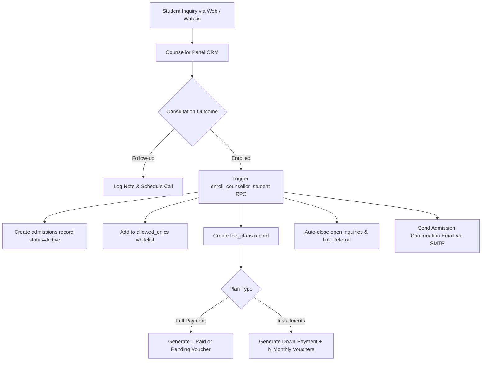
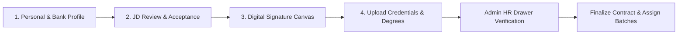

# DeepSkills Project Context & Architectural Specification

> **Purpose**: This document provides a complete, authoritative, and end-to-end technical overview of the **DeepSkills** codebase. It is designed to be ingested by an AI Large Language Model (LLM) or human engineer to instantly understand the business domain, directory layout, rendering pipelines, database schema, authentication/authorization flows, API endpoints, and critical implementation conventions.

---

## 1. Executive Summary & Business Domain

**DeepSkills** (`deepskills-web`) is a dual-purpose educational and institutional management platform built for the **DeepSkills Training Institute** in Pakistan (Lahore, Punjab; canonical URL: `https://deepskills.pk`).

The application consists of two integrated operational hemispheres:
1. **Public Marketing & E-Learning Portal**: High-performance, SEO-optimized marketing pages showcasing technical training programs (Full Stack React, Laravel Mastery, WordPress Mastery, Graphic Design), interactive inquiry/enrollment funnels, institutional blog engine with CMS capabilities, media galleries, student reviews, and public certificate verification.
2. **Institutional ERP & Learning Management System (LMS)**: Three strictly gated, client-rendered role-based dashboards (`/admin`, `/teacher`, `/student`) driving day-to-day campus operations:
   - **Lead & Admissions Pipeline**: Real-time counsellor CRM tracking student inquiries from walk-in, phone, or web lead through consultation, fee discount negotiation, batch assignment, and automated fee voucher generation.
   - **Academic Engine**: Geofenced daily student attendance, batch-level timetable tracking, assignment/quiz publishing with attachments, student submission handling, rubrics-based grading, midterm/final exam result compilation, and automated certificate generation.
   - **Financial Management**: Multi-installment fee scheduling, payment ledger, voucher generation, fee concession workflows, and instructor payroll history.
   - **HR Management & Onboarding**: Digital faculty onboarding pipeline including personal dossier collection, Job Description (JD) composition, interactive digital signature pad, PDF contract compilation, document file review, and hiring finalization.
   - **Internal Communication & Support**: Announcements (broadcast or targeted by course/batch/role) with attachments and read-receipt tracking, student grievance/complaint ticketing system with threaded replies, and real-time batch group chats.
   - **Growth & Referrals**: Student and teacher referral code generation with tracked commission rewards (cash or fee discounts).

---

## 2. Technology Stack & Runtime Specifications

| Layer | Technologies & Versions | Key Libraries / Utilities |
|---|---|---|
| **Runtime & Language** | Node.js (>= 20.x), Modern ES6+ JavaScript, PHP 8.x | Babel / Webpack 5 / Turbopack |
| **Framework** | **Next.js 16.2.4** (Pages Router) | `next/image`, `next/head`, `next/script`, `next-sitemap` |
| **UI Library** | **React 19.2.4** & **React DOM 19.2.4** | `styled-components 6.3.9` (SSR style injection enabled) |
| **Animations & Icons** | `framer-motion 12.34.0`, `react-icons 5.5.0` | `react-slick 0.31.0`, `slick-carousel 1.8.1` |
| **Data Visualization** | `recharts 3.8.1` | Analytics bar charts, pie charts, growth curves |
| **Rich Text CMS** | **TipTap 3.22.5** | `@tiptap/react`, `@tiptap/starter-kit`, `@tiptap/extension-image`, `@tiptap/extension-link`, `@tiptap/extension-placeholder`, `@tiptap/extension-underline`, `@tiptap/html` |
| **Document Generation** | `jspdf 4.2.1`, `html2canvas 1.4.1`, `jszip 3.10.1` | PDF certificates, fee vouchers, ZIP document exports |
| **Database & Auth** | **Supabase (PostgreSQL 15+)** (`@supabase/supabase-js 2.101.1`) | Row Level Security (RLS), Realtime subscriptions, Storage, PL/pgSQL RPCs |
| **Legacy Compatibility** | `react-router-dom 7.13.0` | Aliased to `lib/nextRouterDomCompat.js` via Webpack & Turbopack |
| **Notification System** | `react-hot-toast 2.6.0`, Supabase Realtime | Native toasts + Supabase `notifications` table |
| **Secondary Backend** | PHP 8.x under `public/api/` | Native mail/SMTP delivery, passwordless OTP verification, Apache co-hosting |

---

## 3. Dual Deployment & Rendering Architecture

The project supports two distinct build and deployment targets from a single codebase:

### Mode A: Full Node.js Server Deployment (Primary Target)
- **Target Environments**: VPS, Docker, AWS EC2, or cPanel Node.js Application Manager (Passenger).
- **Commands**:
  ```bash
  npm run build   # next build --webpack + next-sitemap
  npm start       # runs custom server.js listening on process.env.PORT
  ```
- **Rendering Model**:
  - **Public Static Pages**: Static Site Generation (SSG) with Incremental Static Regeneration (ISR).
    - Marketing pages (`/`, `/courses`, `/media`, `/trainers`): Revalidate every 300 seconds (5 min).
    - Blog posts (`/blogs`, `/blogs/[slug]`): Revalidate every 60 seconds; `fallback: 'blocking'` to render new published articles immediately.
    - Course detail pages (`/courses/[slug]`): Revalidate every 3600 seconds (1 hour).
    - Static pages (`/about`, `/contact`, `/founder-message`, `/inquiry`): Fully pre-rendered static HTML.
  - **On-Demand ISR**: Content modifications in Admin panel trigger `POST /api/revalidate` with `REVALIDATE_SECRET` to instantly purge and rebuild modified paths.
  - **Portals (`/admin`, `/student`, `/teacher`)**: Client-side rendering only (`dynamic(() => import(...), { ssr: false })`) wrapped with `NextPortalGuard` and `<meta name="robots" content="noindex,nofollow" />`.
  - **Next.js API Routes (`pages/api/*`)**: Active for blog CRUD, counselor enrollments, revalidation, and cron cleanup.

### Mode B: Static Export for Shared Hosting (PHP-Only Mode)
- **Target Environments**: Shared cPanel hosting without Node.js daemon support.
- **Command**:
  ```bash
  npm run build:static   # executed via scripts/build-static.js
  ```
- **Mechanism**:
  - `scripts/build-static.js` stashes `pages/api/` and `pages/server-sitemap.xml.js` into `.export-stash/` (since Next static export disallows server routes).
  - Builds with `NEXT_OUTPUT=export`, outputting static files into `out/`.
  - Next exports `public/api/*.php` into `out/api/*.php`.
  - Restores the stashed files even if the build errors.
  - Upload `out/` and the root `.htaccess` to Apache `public_html`.

---

## 4. Directory & Codebase Layout

```
DeepSkills/
├── .env.example                 # Template for environment variables
├── .htaccess                    # Apache routing rules, redirects, rewrites, and security headers
├── next.config.js               # Webpack/Turbopack aliases, image remote patterns, rewrites, redirects
├── package.json                 # Scripts and package dependencies
├── server.js                    # Custom Node.js HTTP server wrapper honoring $PORT
├── next-sitemap.config.js       # Sitemap generator configuration
│
├── data/
│   └── siteContent.js           # Hardcoded fallback course outlines, site meta, blog data
│
├── lib/                         # Core server & client helper libraries
│   ├── analytics.js             # GA4 measurement helper (pageview, trackEvent)
│   ├── blog.js                  # Blog utilities (slugify, stripHtml, countWords, read time)
│   ├── nextRouterDomCompat.js   # Shim aliasing react-router-dom Link/useNavigate to Next.js
│   ├── rendering.js             # ISR vs Export helpers (maybeRevalidate, staticFallback)
│   ├── seo.js                   # Canonical URL builders and meta title formatting
│   ├── structuredData.js        # Schema.org JSON-LD generators (EducationalOrg, Course, Article)
│   └── supabaseServer.js        # Server-only Supabase client (service role key bypass)
│
├── components/
│   └── next/                    # Next-specific UI wrappers
│       ├── NextPortalGuard.js   # RBAC & authentication protection wrapper for portal routes
│       ├── PrivatePortalNotice.js # 404/Access Denied fallback notice
│       ├── PublicLayout.js      # Global header/footer wrapper for public pages
│       ├── Seo.js               # Dynamic Head injection for meta tags, OpenGraph, JSON-LD
│       └── SmartCoverImage.js   # Responsive Next image wrapper with fallback logic
│
├── pages/                       # Next.js Pages Router
│   ├── _app.js                  # App root, providers (Auth, Notifications), GA4 script, toasts
│   ├── _document.js             # Document structure, styled-components SSR stylesheet collector
│   ├── index.js                 # Public homepage (SSG + ISR)
│   ├── about.js                 # About page
│   ├── contact.js               # Contact page with lead inquiry form
│   ├── founder-message.js       # Institutional founder statement
│   ├── inquiry.js               # Student admission application form
│   ├── login.js                 # Universal OTP / CNIC login portal
│   ├── media.js                 # Institutional media showcase
│   ├── trainers.js              # Faculty showcase
│   ├── verify-certificate.js    # Public certificate verification lookup
│   ├── server-sitemap.xml.js    # Dynamic XML sitemap for search engines
│   │
│   ├── courses/
│   │   ├── index.js             # Course catalog directory (SSG + ISR)
│   │   └── [slug].js            # Dynamic course detail pages (SSG + ISR)
│   │
│   ├── blogs/
│   │   ├── index.js             # Blog post directory (SSG + ISR)
│   │   └── [slug].js            # Individual blog post page (SSG + ISR)
│   │   └── post.js              # Client-side fallback reader for export mode
│   │
│   ├── admin/
│   │   └── [[...path]].js       # Catch-all client-rendered Admin Portal
│   ├── student/
│   │   └── [[...path]].js       # Catch-all client-rendered Student Portal
│   ├── teacher/
│   │   └── [[...path]].js       # Catch-all client-rendered Teacher Portal
│   │
│   └── api/                     # Next.js Server API Routes (Node deployment mode)
│       ├── admission-email.js   # SMTP admission confirmation email dispatcher
│       ├── blog-view.js         # Atomic view-counter incrementer for articles
│       ├── revalidate.js        # On-demand ISR revalidation webhook
│       ├── admin/
│       │   └── enroll-counsellor-student.js # Server RPC proxy for admissions
│       ├── blog/
│       │   ├── index.js         # Blog listing & creation API
│       │   └── [id].js          # Blog update/deletion API
│       └── notifications/
│           └── cleanup.js       # Cron endpoint for purging stale notifications
│
├── src/                         # React UI Components & Client Architecture
│   ├── supabaseClient.js        # Client-side Supabase instance (browser session)
│   ├── supabasePublicClient.js  # Anon client for unauthenticated public reads
│   ├── GlobalStyle.js           # Styled-components global styles & resets
│   ├── index.css                # Base stylesheet, font definitions, custom scrollbars
│   │
│   ├── context/                 # Global React Contexts
│   │   ├── AuthContext.js       # Session management, CNIC OTP login, Supabase Admin auth
│   │   ├── AnnouncementsContext.js # Realtime announcement feeds & read trackers
│   │   ├── ComplaintsContext.js # Ticketing context for student/teacher grievances
│   │   ├── DepartmentContext.js # Admin department navigation switcher state
│   │   ├── GroupChatContext.js  # Realtime batch group chat channels
│   │   └── TasksContext.js      # Assignment & task state management
│   │
│   ├── hooks/
│   │   └── useNotifications.js  # Realtime notification subscription hook
│   │
│   ├── utils/                   # Client-side business logic & utilities
│   │   ├── activityLogger.js    # Device & event logging into `activity_logs`
│   │   ├── autoAttendance.js    # Geofenced radius calculation & auto-marking
│   │   ├── csvExport.js         # Generic table to CSV exporter
│   │   ├── departments.js       # Admin department definitions & nav maps
│   │   ├── emailNotifications.js# Client email dispatch wrappers
│   │   ├── enrollmentNavigation.js # Portal route resolvers
│   │   ├── hrApi.js             # HR profile, signature, and JD API requests
│   │   ├── hrDocuments.js       # Document upload, category, and validation helpers
│   │   ├── hrJdBuilder.js       # JD template merger with teacher profiles
│   │   ├── hrPdf.js             # PDF contract & document compiler
│   │   ├── hrStorage.js         # Supabase storage upload helpers for HR files
│   │   ├── notifications.js     # Dispatchers for in-app notifications
│   │   ├── permissions.js       # 17-module RBAC permission matrix resolver
│   │   ├── referralUtils.js     # Code formatting and link generators
│   │   ├── resultUtils.js       # Grade, GPA, attendance weighting, and rank calculator
│   │   ├── revalidatePublic.js  # Admin client trigger for ISR revalidation
│   │   ├── teacherUtils.js      # Batch and subject mapping helpers
│   │   └── userManagementApi.js # User and custom role CRUD operations
│   │
│   ├── components/              # Shared Portal & Marketing Components
│   │   ├── AdminLayout.js       # Admin dashboard shell with multi-department sidebar
│   │   ├── DashboardLayout.js   # Generic portal layout shell
│   │   ├── GroupChat.js         # Realtime chat UI component
│   │   ├── InstantDoubt.js      # Student instant doubt submission modal
│   │   ├── NotificationBell.js  # Header notification bell with live counter
│   │   ├── ToastNotifications.js# Global toast container
│   │   ├── portal/              # Unified Portal Design System Tokens & Components
│   │   │   ├── PortalTheme.js   # Dark mode design tokens (colors, gradients, radii)
│   │   │   ├── PortalHeader.js  # Standardized dashboard topbar
│   │   │   ├── PortalCard.js    # Glassmorphic card surface
│   │   │   ├── MetricCard.js    # Key performance metric card with trends
│   │   │   ├── StatusPill.js    # Colored badge for statuses (active, pending, etc.)
│   │   │   └── EmptyState.js    # Empty data placeholder with illustration
│   │   └── hr/                  # HR Onboarding Stepper Components
│   │       ├── AdminHRDrawer.js # Admin side-drawer for reviewing teacher files
│   │       ├── AdminHRTable.js  # Teacher onboarding progress data table
│   │       ├── AdminJDComposer.js # Interactive JD template editor
│   │       ├── AdminFinalizeHiringModal.js # Salary & contract finalizer
│   │       ├── HRStepper.js     # 4-step onboarding progress tracker
│   │       ├── HRProfileForm.js # Step 1: Personal, academic & bank details
│   │       ├── HRJDReviewStep.js# Step 2: Job description acknowledgement
│   │       ├── HRSignatureStep.js# Step 3: Interactive canvas digital signature
│   │       ├── HRDocumentsStep.js# Step 4: CNIC, degree, and experience uploads
│   │       ├── HRFilesStep.js   # Final document dossier inspector
│   │       └── SignatureCanvas.js # HTML5 Canvas for drawing signatures
│   │
│   ├── admin/                   # Admin Portal Route Views
│   │   ├── Dashboard.js         # Main institutional overview (stats, graphs, alerts)
│   │   ├── CounsellorPanel.js   # Lead tracking, inquiry pipeline, quick enrollment
│   │   ├── EnrollmentManager.js # Direct student admission & batch placement
│   │   ├── StudentManager.js    # Student directory, filtering, batch actions
│   │   ├── StudentProfile.js    # Detailed student dossier (finance, attendance, tasks)
│   │   ├── TeacherManager.js    # Faculty directory, status toggles, batch allocation
│   │   ├── TeacherProfile.js    # Teacher performance, batches, salary history
│   │   ├── AdminHRManagement.js # HR candidate pipelines, JD builder, digital hiring
│   │   ├── CourseManager.js     # Courses & Batches creator/editor
│   │   ├── CourseDetailPage.js  # Specific course curriculum & batch details
│   │   ├── AdminAttendance.js   # Daily campus-wide attendance inspection
│   │   ├── AdminAttendanceSettings.js # Campus GPS geofence radius & timing config
│   │   ├── FinanceManager.js    # Fee collection overview, pending dues, installment plans
│   │   ├── TransactionHistory.js# Payment receipts ledger, manual voucher collection
│   │   ├── CertificateManager.js# Issue certificates, review verification status
│   │   ├── AdminResults.js      # Marks entry, midterm/final term grade calculation
│   │   ├── ReportsSystem.js     # Comprehensive reporting (Master, Counsellor, Finance, Academic)
│   │   ├── BlogManager.js       # TipTap CMS for writing, scheduling, publishing posts
│   │   ├── AdminAnnouncements.js# Create and target announcements
│   │   ├── AdminComplaints.js   # Student/Teacher complaint ticketing desk
│   │   ├── AdminReferral.js     # Referral reward approval and payout management
│   │   ├── AdminUserManagement.js # Staff accounts, custom role RBAC assignment
│   │   ├── AdminActivityLogsPage.js # User audit trail & IP/device log viewer
│   │   ├── MediaLibrary.js      # Upload/manage marketing media assets
│   │   ├── MediaPageManager.js  # Curate public `/media` page content
│   │   ├── TestimonialManager.js# Manage student video & text reviews
│   │   └── ContentManager.js    # Edit marketing homepage texts and banners
│   │
│   ├── teacher/                 # Teacher Portal Route Views
│   │   ├── TeacherStudents.js   # Roster of students in assigned batches
│   │   ├── TeacherAttendance.js # Daily batch attendance marking tool
│   │   ├── AssignTask.js        # Create assignments/quizzes with deadlines & attachments
│   │   ├── ViewTasks.js         # Review submissions, grade marks, provide feedback
│   │   ├── TeacherFinance.js    # Monthly salary payment slips & ledger
│   │   ├── TeacherAnnouncements.js # Batch announcements creator & feed
│   │   ├── TeacherComplaints.js # Teacher grievance filing & responses
│   │   ├── TeacherGroupChat.js  # Live chat channel with batch students
│   │   └── TeacherHRPage.js     # Teacher onboarding completion stepper
│   │
│   └── student/                 # Student Portal Route Views
│       ├── StudentTasks.js      # Student assignment feed, submission uploader
│       ├── StudentProgress.js   # Overall academic performance & attendance score
│       ├── StudentAttendance.js # Calendar & log of student attendance records
│       ├── StudentFinance.js    # Fee installment schedule, payment receipts & vouchers
│       ├── StudentResults.js    # Midterm & Final term report cards
│       ├── StudentCertificate.js# View earned certificates & download PDF
│       ├── StudentComplaints.js # Lodge support tickets/complaints with administration
│       ├── StudentAnnouncements.js # Student announcement stream
│       ├── StudentGroupChat.js  # Interactive batch discussion room
│       └── NewEnrollment.js     # In-app enrollment into additional courses
│
├── public/                      # Static Assets & PHP Backend Endpoints
│   ├── api/                     # Co-located PHP Backend Endpoints (Mode B & Apache)
│   │   ├── auth/
│   │   │   ├── _otp_common.php  # Environment parser, DB helper, CORS, input sanitizer
│   │   │   ├── send-otp.php     # Validates CNIC, checks allowed_cnics, sends 6-digit OTP
│   │   │   ├── verify-otp.php   # Compares OTP hash, generates 32-byte verification token
│   │   │   └── validate-token.php # Validates token, returns user object & permission map
│   │   ├── admin/
│   │   │   ├── enroll-counsellor-student.php # Counsellor enrollment processor
│   │   │   ├── get-applications.php # Fetch online admission applications
│   │   │   ├── process-application.php # Approve/reject admissions
│   │   │   └── hr/
│   │   │       ├── send-jd.php  # Dispatch JD to teacher
│   │   │       ├── finalize.php # Complete teacher onboarding
│   │   │       └── reject.php   # Reject teacher candidate
│   │   ├── hr/
│   │   │   ├── teacher.php      # Teacher HR profile status & fetch
│   │   │   ├── notify-admin.php # Notification trigger on document completion
│   │   │   └── share-files.php  # Dossier sharing utility
│   │   ├── student/
│   │   │   ├── finance.php      # Student fee ledger query
│   │   │   └── results.php      # Student exam marks query
│   │   ├── teacher/
│   │   │   └── finance.php      # Teacher payroll inquiry
│   │   ├── blog/
│   │   │   ├── index.php        # Blog read/write endpoint
│   │   │   └── delete.php       # Blog post removal
│   │   ├── inquiry.php          # Public lead form processor
│   │   ├── contact.php          # Contact form processor
│   │   ├── register.php         # Public student registration fallback
│   │   ├── admission-email.php  # Direct SMTP dispatcher for admissions
│   │   ├── blog-view.php        # Atomic article view incrementer
│   │   └── revalidate.php       # Static export rebuild trigger
│   └── favicon.svg, logo.svg...
│
├── scripts/
│   └── build-static.js          # Build script orchestrating static export
│
└── supabase/                    # Database Infrastructure
    ├── schema/                  # Modular SQL schema declarations
    │   ├── announcements_schema.sql
    │   ├── blog_system.sql
    │   ├── hr_schema.sql
    │   ├── referral_schema.sql
    │   ├── results_schema.sql
    │   ├── teachers_schema.sql
    │   └── user_management_schema.sql
    ├── migrations/              # Versioned SQL migrations (RLS, constraints, RPCs)
    └── seeds/                   # Seed data for development
```

---

## 5. Authentication, Security & RBAC Model

### Dual-Authentication Flow

DeepSkills utilizes a bifurcated authentication system depending on the user role:

1. **Super Administrator Auth (`supabase_admin`)**:
   - Uses native Supabase Auth (`supabase.auth.signInWithPassword` / `getSession`).
   - Grants unconditional `admin` role with full privileges across all 17 system modules.
   - Admin session changes are observed via `supabase.auth.onAuthStateChange`.

2. **Passwordless CNIC + Email OTP Auth (Students, Teachers, Staff)**:
   - Eliminates forgotten passwords and credential sharing. Authenticates users based on their Pakistani Computerized National Identity Card (CNIC) number (format: `XXXXX-XXXXXXX-X` or 13 digits) and a one-time 6-digit numeric OTP sent to their verified email address.
   - **Step 1 (`POST /api/auth/send-otp.php`)**:
     - Client submits normalized 13-digit CNIC.
     - Backend queries `allowed_cnics` whitelist. If not found, checks if an admission application in `admissions` is `Pending` or rejected, returning an appropriate error message.
     - Resolves user profile and email from `admissions` (for students), `teachers` (for teachers), or `users` (for staff).
     - Generates 6-digit OTP, stores `password_hash($otp, PASSWORD_BCRYPT)` in `login_otps` table with 10-minute expiry and attempt counter.
     - Dispatches formatted HTML email containing the code via PHP `mail()` or configured SMTP.
   - **Step 2 (`POST /api/auth/verify-otp.php`)**:
     - Client submits CNIC and entered OTP.
     - Server checks `login_otps` for active, unexpired, unconsumed records.
     - Enforces rate limiting (maximum 5 failed attempts per OTP before invalidation).
     - Validates hash via `password_verify`. Marks OTP as consumed (`consumed_at = NOW()`).
     - Generates cryptographically secure 32-byte verification token (`bin2hex(random_bytes(32))`), stores in `login_otps.verification_token`, and returns it to the client.
   - **Step 3 (`POST /api/auth/validate-token.php`)**:
     - Client submits CNIC and verification token.
     - Validates token against `login_otps`.
     - Compiles and returns the unified `userData` payload containing role, permissions, course, batch, and profile details.
   - **Step 4 (Session Storage)**:
     - `AuthContext.js` saves the user payload to `localStorage.getItem('deepskill_user')`.

### Role-Based Access Control (RBAC) Architecture

Defined in `src/utils/permissions.js`:

#### The 17 Core System Modules:
```javascript
export const MODULE_KEYS = [
  'dashboard',     // Main analytics & overview
  'counsellor',    // Lead management, inquiries & quick enroll
  'students',      // Student directory & admissions
  'teachers',      // Teacher directory & assignments
  'courses',       // Course & batch management
  'attendance',    // Daily attendance & geofence rules
  'tasks',         // Assignments & submissions
  'results',       // Exam results & grading
  'finance',       // Fee plans, payment ledger & transactions
  'complaints',    // Ticketing & support desk
  'announcements', // Institute-wide broadcasts
  'blog',          // Article CMS & scheduling
  'referral',      // Referral codes & commission payouts
  'reports',       // Cross-department analytical reports
  'hr',            // Faculty hiring, JDs, contracts & signatures
  'users',         // Staff user accounts & activity logs
  'settings'       // Testimonials, media library & site settings
];
```

#### Permission Levels:
Each module can be assigned one of three granular states:
- `'none'`: Complete route blocking; hidden from sidebar and direct URL access.
- `'view'`: Read-only access to records and reports.
- `'full'`: Read, create, update, delete, approve, and finalize privileges.

#### Role Categories:
- **`admin`**: Hardcoded `'full'` access across all 17 modules (`ADMIN_FULL_PERMISSIONS`).
- **`custom`**: Sub-administrators, department heads (e.g., HR Manager, Admissions Counsellor, Accountant). Permissions are dynamically loaded from `custom_roles.permissions` JSONB column.
- **`teacher`**: Access limited strictly to `/teacher/*` routes.
- **`student`**: Access limited strictly to `/student/*` routes.

#### Route Protection (`NextPortalGuard.js`):
Every dashboard view is wrapped in `NextPortalGuard`:
```jsx
<NextPortalGuard
  allowedRoles={['admin', 'custom']}
  permissionKey="finance"
  minimum="view"
  loginPath="/admin"
>
  <FinanceManager />
</NextPortalGuard>
```
If unauthenticated, the user is redirected to `loginPath`. If role/permission checks fail, a toast warning is raised, and the user is redirected to their first accessible department path (`getFirstAccessibleAdminPath()`).

---

## 6. Comprehensive Database Schema & Entities

The PostgreSQL schema running on Supabase includes the following primary tables, constraints, foreign keys, and indexes:

### 1. User & Identity Tables
- **`allowed_cnics`**: Whitelist governing who can log into the platform.
  - Columns: `id (UUID PK)`, `cnic (TEXT UNIQUE NOT NULL)`, `name (TEXT)`, `role (TEXT CHECK IN ('student', 'teacher', 'admin', 'custom'))`, `assigned_course (TEXT)`, `batch (TEXT)`, `created_at`.
- **`users`**: Staff and administrative accounts.
  - Columns: `id (UUID PK)`, `full_name (TEXT NOT NULL)`, `cnic (TEXT UNIQUE NOT NULL)`, `phone (TEXT)`, `email (TEXT)`, `role (TEXT NOT NULL)`, `custom_role_id (UUID FK -> custom_roles.id ON DELETE SET NULL)`, `status (TEXT DEFAULT 'active')`, `account_notes (TEXT)`, `last_login (TIMESTAMPTZ)`, `created_by (UUID)`, `created_at`, `updated_at`.
- **`custom_roles`**: RBAC definition for non-superadmin staff.
  - Columns: `id (UUID PK)`, `name (TEXT UNIQUE NOT NULL)`, `description (TEXT)`, `icon (TEXT)`, `color (TEXT)`, `permissions (JSONB NOT NULL)`, `is_builtin (BOOLEAN DEFAULT FALSE)`, `created_at`, `updated_at`.
- **`activity_logs`**: System audit trail.
  - Columns: `id (UUID PK)`, `user_id (UUID FK -> users.id)`, `user_name (TEXT)`, `user_role (TEXT)`, `event_type (TEXT)`, `event_description (TEXT)`, `ip_address (TEXT)`, `device_info (TEXT)`, `created_at (TIMESTAMPTZ DEFAULT NOW())`.
- **`login_otps`**: Passwordless authentication records.
  - Columns: `id (UUID PK)`, `cnic (TEXT NOT NULL)`, `email (TEXT NOT NULL)`, `otp_hash (TEXT NOT NULL)`, `verification_token (TEXT)`, `attempts (INT DEFAULT 0)`, `expires_at (TIMESTAMPTZ NOT NULL)`, `consumed_at (TIMESTAMPTZ)`, `created_at (TIMESTAMPTZ DEFAULT NOW())`.

### 2. Academic & Admissions Tables
- **`admissions`**: Central student repository.
  - Columns: `id (UUID PK)`, `name (TEXT NOT NULL)`, `father_name (TEXT)`, `cnic (TEXT NOT NULL)`, `dob (DATE)`, `gender (TEXT)`, `phone (TEXT)`, `email (TEXT)`, `city (TEXT)`, `address (TEXT)`, `education (TEXT)`, `hear_about_us (TEXT)`, `referred_by (TEXT)`, `referral_code (TEXT)`, `course (TEXT NOT NULL)`, `batch (TEXT)`, `batch_timing (TEXT)`, `batch_assigned_at (TIMESTAMPTZ)`, `status (TEXT CHECK IN ('Pending', 'Active', 'Completed', 'Dropped', 'Graduated')) DEFAULT 'Pending'`, `enrollment_type (TEXT)`, `enrolled_by (TEXT)`, `enrollment_source (TEXT)`, `inquiry_id (UUID FK -> inquiries.id ON DELETE SET NULL)`, `counsellor_notes (TEXT)`, `discount_amount (INTEGER DEFAULT 0)`, `discount_reason (TEXT)`, `submitted_at (TIMESTAMPTZ)`, `approved_at (TIMESTAMPTZ)`.
- **`courses`**: Course catalog.
  - Columns: `id (UUID PK)`, `title (TEXT NOT NULL)`, `slug (TEXT UNIQUE NOT NULL)`, `category (TEXT)`, `description (TEXT)`, `duration (TEXT)`, `fee (NUMERIC)`, `is_active (BOOLEAN DEFAULT TRUE)`, `created_at`.
- **`batches`**: Class batches and timing slots.
  - Columns: `id (UUID PK)`, `course_id (UUID FK -> courses.id)`, `course_name (TEXT)`, `batch_name (TEXT NOT NULL UNIQUE)`, `start_date (DATE)`, `end_date (DATE)`, `time_shift (TEXT)`, `start_time (TIME)`, `end_time (TIME)`, `timing_label (TEXT)`, `capacity (INTEGER DEFAULT 30)`, `status (TEXT CHECK IN ('Upcoming', 'Active', 'Completed')) DEFAULT 'Upcoming'`, `created_at`.
- **`teachers`**: Instructor profiles.
  - Columns: `id (UUID PK)`, `name (TEXT NOT NULL)`, `cnic (TEXT UNIQUE NOT NULL)`, `phone (TEXT)`, `email (TEXT)`, `specialization (TEXT)`, `status (TEXT DEFAULT 'Active')`, `added_on (TIMESTAMPTZ DEFAULT NOW())`, `notes (TEXT)`.
- **`teacher_batches`**: Many-to-many junction linking teachers to class batches.
  - Columns: `id (UUID PK)`, `teacher_id (UUID FK -> teachers.id ON DELETE CASCADE)`, `batch_id (UUID FK -> batches.id ON DELETE CASCADE)`, `role (TEXT DEFAULT 'Main')`, `created_at`, `UNIQUE(teacher_id, batch_id)`.

### 3. Counsellor CRM Pipeline
- **`inquiries`**: Lead records.
  - Columns: `id (UUID PK)`, `name (TEXT NOT NULL)`, `phone (TEXT NOT NULL)`, `email (TEXT)`, `cnic (TEXT)`, `course_interest (TEXT)`, `source (TEXT)`, `status (TEXT CHECK IN ('new', 'contacted', 'follow_up', 'enrolled', 'dropped')) DEFAULT 'new'`, `admission_id (UUID FK -> admissions.id ON DELETE SET NULL)`, `counsellor_notes (JSONB DEFAULT '[]')`, `created_at`, `last_updated`.
- **`inquiry_notes`**: Timeline audit notes.
  - Columns: `id (UUID PK)`, `inquiry_id (UUID FK -> inquiries.id ON DELETE CASCADE)`, `note (TEXT NOT NULL)`, `status_changed_to (TEXT)`, `added_by (TEXT)`, `created_at`.

### 4. Financial Ledger System
- **`fee_plans`**: Student payment plan agreements.
  - Columns: `id (UUID PK)`, `student_id (UUID FK -> admissions.id ON DELETE CASCADE)`, `course (TEXT)`, `batch (TEXT)`, `total_fee (INTEGER NOT NULL)`, `discount_amount (INTEGER DEFAULT 0)`, `discount_reason (TEXT)`, `final_fee (INTEGER NOT NULL)`, `plan_type (TEXT CHECK IN ('full', 'installment')) NOT NULL`, `installment_count (INTEGER DEFAULT 1)`, `created_by (TEXT)`, `created_at`.
- **`payments`**: Payment vouchers and installment ledger.
  - Columns: `id (UUID PK)`, `entity_id (UUID FK -> admissions.id ON DELETE CASCADE)`, `entity_type (TEXT DEFAULT 'student')`, `installment_number (INTEGER)`, `total_installments (INTEGER)`, `amount (INTEGER NOT NULL)`, `due_date (DATE)`, `paid_date (DATE)`, `method (TEXT CHECK IN ('cash', 'bank_transfer', 'online', 'cheque'))`, `reference_number (TEXT)`, `status (TEXT CHECK IN ('pending', 'paid', 'overdue', 'cancelled')) DEFAULT 'pending'`, `description (TEXT)`, `notes (TEXT)`, `created_at`.
- **`teacher_payments`**: Faculty payroll disbursements.
  - Columns: `id (UUID PK)`, `teacher_id (UUID FK -> teachers.id ON DELETE CASCADE)`, `amount (DECIMAL(10,2) NOT NULL)`, `month (TEXT NOT NULL)`, `paid_on (DATE DEFAULT CURRENT_DATE)`, `method (TEXT)`, `reference (TEXT)`, `notes (TEXT)`, `status (TEXT DEFAULT 'Paid')`.

### 5. Attendance & Geofencing
- **`attendance`**: Daily attendance roll.
  - Columns: `id (UUID PK)`, `student_id (UUID FK -> admissions.id ON DELETE CASCADE)`, `batch (TEXT NOT NULL)`, `date (DATE NOT NULL)`, `status (TEXT CHECK IN ('present', 'absent', 'late', 'leave')) NOT NULL`, `marked_by (TEXT)`, `marked_at (TIMESTAMPTZ DEFAULT NOW())`, `latitude (NUMERIC)`, `longitude (NUMERIC)`, `is_auto (BOOLEAN DEFAULT FALSE)`, `notes (TEXT)`, `UNIQUE(student_id, date)`.
- **`attendance_settings`**: Geofencing rules and thresholds stored in key-value format.
  - Coordinates: Latitude `31.5204`, Longitude `74.3587`, Radius `100` meters, Accuracy buffer `200` meters, On-time window `15` min, Late threshold `15` min, Absent cutoff `60` min.

### 6. Tasks, Exams & Certificates
- **`tasks`**: Assignments and quizzes created by teachers or admins.
  - Columns: `id (UUID PK)`, `title (TEXT NOT NULL)`, `description (TEXT)`, `category (TEXT CHECK IN ('Assignment', 'Quiz', 'Project')) DEFAULT 'Assignment'`, `course (TEXT)`, `batch (TEXT NOT NULL)`, `created_by (UUID)`, `due_date (TIMESTAMPTZ)`, `total_marks (INTEGER DEFAULT 100)`, `file_url (TEXT)`, `file_name (TEXT)`, `created_at`.
- **`task_submissions`**: Student assignment submissions.
  - Columns: `id (UUID PK)`, `task_id (UUID FK -> tasks.id ON DELETE CASCADE)`, `student_id (UUID FK -> admissions.id ON DELETE CASCADE)`, `submission_text (TEXT)`, `file_url (TEXT)`, `file_name (TEXT)`, `submitted_at (TIMESTAMPTZ DEFAULT NOW())`, `status (TEXT CHECK IN ('submitted', 'graded', 'late', 'resubmit')) DEFAULT 'submitted'`, `marks_obtained (NUMERIC)`, `feedback (TEXT)`, `graded_at (TIMESTAMPTZ)`, `graded_by (UUID)`.
- **`results`**: Compiled academic report card records.
  - Columns: `id (UUID PK)`, `student_id (UUID FK -> admissions.id ON DELETE CASCADE)`, `batch_id (TEXT)`, `exam_type (TEXT CHECK IN ('midterm', 'finalterm')) NOT NULL`, `attendance_marks (NUMERIC)`, `assignment_marks (NUMERIC)`, `quiz_marks (NUMERIC)`, `task_completion_marks (NUMERIC)`, `project_marks (NUMERIC DEFAULT 0)`, `total_marks (NUMERIC)`, `grade (TEXT)`, `remarks (TEXT)`, `passed (BOOLEAN)`, `batch_rank (INTEGER)`, `computed_at (TIMESTAMPTZ DEFAULT NOW())`, `UNIQUE(student_id, exam_type)`.
- **`certificates`**: Digital credentials issued to graduating students.
  - Columns: `id (UUID PK)`, `certificate_number (TEXT UNIQUE NOT NULL)`, `student_id (UUID FK -> admissions.id)`, `student_name (TEXT NOT NULL)`, `course_name (TEXT NOT NULL)`, `issue_date (DATE NOT NULL)`, `grade (TEXT)`, `status (TEXT DEFAULT 'Valid')`, `pdf_url (TEXT)`, `created_at`.

### 7. HR Onboarding System
- **`hr_profiles`**: Teacher hiring dossier.
  - Columns: `id (UUID PK)`, `teacher_id (UUID FK -> teachers.id ON DELETE CASCADE UNIQUE)`, `full_name (TEXT)`, `father_name (TEXT)`, `date_of_birth (DATE)`, `gender (TEXT)`, `cnic (TEXT)`, `personal_phone (TEXT)`, `personal_email (TEXT)`, `current_address (TEXT)`, `permanent_address (TEXT)`, `specialization (TEXT)`, `years_experience (INTEGER)`, `last_employer (TEXT)`, `linkedin (TEXT)`, `expected_salary (INTEGER)`, `available_to_join (DATE)`, `teaching_mode (TEXT)`, `emergency_name (TEXT)`, `emergency_relationship (TEXT)`, `emergency_phone (TEXT)`, `current_step (INTEGER DEFAULT 1)`, `hr_status (TEXT DEFAULT 'pending')`, `documents_submitted_at (TIMESTAMPTZ)`, `hired_at (TIMESTAMPTZ)`, `rejected_at (TIMESTAMPTZ)`, `rejection_reason (TEXT)`, `created_at`, `updated_at`.
- **`hr_documents`**: Uploaded candidate credentials.
  - Columns: `id (UUID PK)`, `hr_profile_id (UUID FK -> hr_profiles.id ON DELETE CASCADE)`, `category (TEXT)`, `doc_type (TEXT)`, `file_name (TEXT)`, `file_url (TEXT)`, `file_size (TEXT)`, `verified_by_admin (BOOLEAN DEFAULT FALSE)`, `uploaded_at (TIMESTAMPTZ DEFAULT NOW())`.
- **`hr_signatures`**: Digital signature canvas records.
  - Columns: `id (UUID PK)`, `hr_profile_id (UUID FK -> hr_profiles.id ON DELETE CASCADE UNIQUE)`, `signature_data_url (TEXT NOT NULL)`, `signed_at (TIMESTAMPTZ DEFAULT NOW())`, `signer_ip (TEXT)`.
- **`hr_jds`**: Contract and Job Description templates.
  - Columns: `id (UUID PK)`, `title_template (TEXT)`, `specialization (TEXT)`, `employment_type (TEXT)`, `responsibilities (JSONB)`, `requirements (JSONB)`, `benefits (JSONB)`, `created_at`.

### 8. Communication & Support
- **`announcements`**: Broadcast & targeted news items.
  - Columns: `id (UUID PK)`, `title (TEXT NOT NULL)`, `body (TEXT NOT NULL)`, `posted_by_id (UUID)`, `posted_by_name (TEXT)`, `posted_by_role (TEXT CHECK IN ('admin', 'teacher'))`, `audience_type (TEXT CHECK IN ('broadcast', 'targeted'))`, `audience_courses (TEXT[])`, `audience_batches (TEXT[])`, `audience_roles (TEXT[])`, `is_pinned (BOOLEAN DEFAULT FALSE)`, `is_active (BOOLEAN DEFAULT TRUE)`, `scheduled_at (TIMESTAMPTZ)`, `posted_at (TIMESTAMPTZ DEFAULT NOW())`, `created_at`.
- **`announcement_attachments`**: Files attached to announcements.
  - Columns: `id (UUID PK)`, `announcement_id (UUID FK -> announcements.id ON DELETE CASCADE)`, `file_name (TEXT)`, `file_size (TEXT)`, `file_url (TEXT)`, `file_type (TEXT)`.
- **`announcement_reads`**: Read receipts per user.
  - Columns: `id (UUID PK)`, `announcement_id (UUID FK -> announcements.id ON DELETE CASCADE)`, `user_id (TEXT)`, `read_at (TIMESTAMPTZ DEFAULT NOW())`, `UNIQUE(announcement_id, user_id)`.
- **`complaints`**: Student and teacher grievances.
  - Columns: `id (UUID PK)`, `user_id (UUID)`, `user_name (TEXT NOT NULL)`, `user_role (TEXT NOT NULL)`, `category (TEXT)`, `subject (TEXT NOT NULL)`, `description (TEXT NOT NULL)`, `status (TEXT CHECK IN ('open', 'in_progress', 'resolved', 'closed')) DEFAULT 'open'`, `priority (TEXT CHECK IN ('low', 'medium', 'high', 'urgent')) DEFAULT 'medium'`, `created_at`, `updated_at`.
- **`complaint_replies`**: Threaded replies on complaint tickets.
  - Columns: `id (UUID PK)`, `complaint_id (UUID FK -> complaints.id ON DELETE CASCADE)`, `sender_id (UUID)`, `sender_name (TEXT NOT NULL)`, `sender_role (TEXT NOT NULL)`, `message (TEXT NOT NULL)`, `created_at (TIMESTAMPTZ DEFAULT NOW())`.
- **`notifications`**: In-app push notifications.
  - Columns: `id (UUID PK)`, `recipient_id (TEXT NOT NULL)`, `title (TEXT NOT NULL)`, `message (TEXT NOT NULL)`, `type (TEXT)`, `link (TEXT)`, `is_read (BOOLEAN DEFAULT FALSE)`, `created_at (TIMESTAMPTZ DEFAULT NOW())`.

### 9. Growth & Referrals
- **`referral_codes`**: Unique affiliate codes.
  - Columns: `id (UUID PK)`, `user_id (UUID NOT NULL)`, `user_role (TEXT CHECK IN ('student', 'teacher'))`, `code (TEXT UNIQUE NOT NULL)`, `created_at`.
- **`referrals`**: Referral attribution and commissions.
  - Columns: `id (UUID PK)`, `referrer_id (UUID NOT NULL)`, `referrer_role (TEXT)`, `referred_name (TEXT)`, `referred_phone (TEXT)`, `referred_email (TEXT)`, `referred_id (UUID UNIQUE FK -> admissions.id ON DELETE SET NULL)`, `referred_at (TIMESTAMPTZ DEFAULT NOW())`, `status (TEXT CHECK IN ('registered', 'approved', 'enrolled')) DEFAULT 'registered'`, `reward_type (TEXT CHECK IN ('cash', 'fee_discount'))`, `reward_amount (INTEGER)`, `payout_status (TEXT CHECK IN ('not_earned', 'pending', 'paid')) DEFAULT 'not_earned'`, `payout_approved_at (TIMESTAMPTZ)`, `payout_method (TEXT)`, `payout_reference (TEXT)`, `payout_notes (TEXT)`, `approved_by (UUID)`.
- **`referral_settings`**: Global referral rewards config (`id=1`, `cash_reward=1000`, `fee_discount=1500`, `is_active=TRUE`).

### 10. Content Management System (CMS)
- **`blog_posts`**: Articles.
  - Columns: `id (UUID PK)`, `title (TEXT NOT NULL)`, `slug (TEXT UNIQUE NOT NULL)`, `excerpt (TEXT)`, `content (JSONB)`, `content_html (TEXT)`, `cover_image (TEXT)`, `category (TEXT)`, `tags (TEXT[])`, `author_id (UUID)`, `author_name (TEXT)`, `status (TEXT CHECK IN ('draft', 'published', 'scheduled')) DEFAULT 'draft'`, `is_featured (BOOLEAN DEFAULT FALSE)`, `scheduled_at (TIMESTAMPTZ)`, `published_at (TIMESTAMPTZ)`, `reading_time (INTEGER)`, `view_count (INTEGER DEFAULT 0)`, `meta_title (TEXT)`, `meta_description (TEXT)`, `canonical_url (TEXT)`, `related_course_ids (TEXT[])`, `created_at`, `updated_at`.
- **`blog_categories`**: `id (UUID PK)`, `name (TEXT UNIQUE)`, `slug (TEXT UNIQUE)`, `color (TEXT)`.
- **`testimonials`**: `id (UUID PK)`, `student_name (TEXT)`, `course_name (TEXT)`, `review_text (TEXT)`, `rating (INTEGER)`, `video_url (TEXT)`, `thumbnail_url (TEXT)`, `is_featured (BOOLEAN)`, `created_at`.
- **`media_items`**: `id (UUID PK)`, `title (TEXT)`, `slug (TEXT UNIQUE)`, `type (TEXT)`, `summary (TEXT)`, `media_url (TEXT)`, `created_at`.

### Core Supabase Stored Procedures (RPCs)
- **`enroll_counsellor_student(payload JSONB)`**: Atomic transaction performing all actions required when enrolling a student:
  1. Validates required fields (`cnic`, `name`, `course`, `batchId`).
  2. Normalizes `plan_type` strictly to `'full'` or `'installment'`.
  3. Normalizes `payment_method` strictly to `'cash'`, `'bank_transfer'`, `'online'`, or `'cheque'`.
  4. Checks for duplicate active course enrollments and verifies batch capacity (`capacity <= 30`).
  5. Inserts record into `admissions` with status `'Active'`.
  6. Upserts into `allowed_cnics` whitelist with role `'student'`.
  7. Creates `fee_plans` record.
  8. Generates balanced `payments` vouchers (allocating installment remainders evenly to ensure zero rupee rounding loss).
  9. Closes associated `inquiries` and updates `inquiry_notes`.
  10. Attaches referral attribution to `referrals` if a valid referral code was supplied.
- **`increment_blog_view(post_slug TEXT)`**: Atomic SQL view counter incrementer.

### Supabase Storage Buckets
- `blog`: Cover images and inline article illustrations.
- `media`: Campus photos and institutional media.
- `hr-documents`: Candidate resumes, CNIC scans, degree certificates, experience letters.
- `task-files`: Assignment briefs and student assignment uploads.
- `announcements`: Attachments linked to broadcasts.
- `certificates`: Generated PDF certificate documents.

---

## 7. Key Portal & Functional Workflows

### A. Admissions & Fee Scheduling Workflow


### B. Daily Geofenced Attendance Workflow
1. Admin sets institutional latitude/longitude and radius (default 100 meters) in `/admin/academic/attendance`.
2. When teacher/student marks attendance, HTML5 Geolocation API obtains device coordinates.
3. `src/utils/autoAttendance.js` computes distance via the Haversine formula.
4. Timestamps are evaluated against shift start time:
   - Within `onTimeWindowMins` (15m): Status = `'present'`.
   - Between 15m and `absentCutoffMins` (60m): Status = `'late'` (credited as present in academic scoring).
   - Past 60m: Status = `'absent'`.
5. Records are committed to `attendance` table. Changes trigger real-time parent/student notifications if absent.

### C. Academic Scoring & Rank Compilation
In `src/utils/resultUtils.js`, final exam grades are computed using weighted components:
$$\text{Attendance Marks} = \left( \frac{\text{Sessions Present or Late}}{\text{Total Sessions}} \right) \times \text{Weight}_{\text{att}}$$
$$\text{Assignment Marks} = \text{Average}\left( \frac{\text{Marks Obtained}}{\text{Total Marks}} \right) \times \text{Weight}_{\text{assign}}$$
$$\text{Quiz Marks} = \text{Average}\left( \frac{\text{Marks Obtained}}{\text{Total Marks}} \right) \times \text{Weight}_{\text{quiz}}$$
$$\text{Total Score} = \text{Attendance} + \text{Assignments} + \text{Quizzes} + \text{Project Marks}$$
- Grades: `A+` ($\ge 90\%$), `A` ($\ge 80\%$), `B` ($\ge 70\%$), `C` ($\ge 60\%$), `D` ($\ge 50\%$), `F` ($< 50\%$).
- Batch Rank: Evaluated across all students in the batch and cached in `results`.

### D. HR Faculty Onboarding Stepper


---

## 8. Complete API Catalog

### 1. Next.js API Routes (`pages/api/*`) - Node Deployment Mode

| Endpoint | Method | Purpose & Payload |
|---|---|---|
| `/api/admin/enroll-counsellor-student` | `POST` | Proxy to Supabase RPC `enroll_counsellor_student`. Normalizes plan and payment method, sanitizes numeric values, and enforces batch capacity. |
| `/api/admission-email` | `POST` | Dispatches admission confirmation email with course, batch timing, and student credentials via Nodemailer / PHP transport. |
| `/api/blog/index` | `GET`, `POST` | `GET`: Fetch published posts with pagination/tag filtering. `POST`: Create new post (requires admin session). |
| `/api/blog/[id]` | `PUT`, `DELETE`| Update or delete blog posts by UUID. |
| `/api/blog-view` | `POST` | Atomic counter calling RPC `increment_blog_view` for `{ slug }`. |
| `/api/revalidate` | `POST` | Triggers Next.js on-demand ISR for paths array: `{ secret, paths: ['/', '/blogs'] }`. |
| `/api/notifications/cleanup` | `POST` | Cron route authenticated by `CRON_SECRET` to purge read notifications older than 30 days. |

### 2. PHP Backend Service Endpoints (`public/api/*`)

| Script Path | Method | Key Parameters | Operational Description |
|---|---|---|---|
| `/api/auth/send-otp.php` | `POST` | `{ cnic }` | Verifies CNIC in `allowed_cnics`, hashes 6-digit OTP, saves in `login_otps`, and sends verification email. |
| `/api/auth/verify-otp.php` | `POST` | `{ cnic, otp }` | Validates OTP hash, enforces 5-attempt limit, issues 32-byte `verification_token`. |
| `/api/auth/validate-token.php` | `POST` | `{ cnic, verificationToken }` | Exchanges token for complete user session with permission map and roles. |
| `/api/inquiry.php` | `POST` | `{ name, phone, course, ... }` | Inserts public lead into `inquiries` table and sends email alert. |
| `/api/contact.php` | `POST` | `{ name, email, message }` | General inquiry form handler. |
| `/api/register.php` | `POST` | Student application data | Fallback direct registration creating `admissions` record. |
| `/api/admission-email.php` | `POST` | `{ email, name, course, batch }` | Secondary PHP email dispatcher using native `mail()`. |
| `/api/admin/hr/send-jd.php` | `POST` | `{ teacherId, jdTemplateId }` | Attaches tailored JD to teacher onboarding profile. |
| `/api/admin/hr/finalize.php` | `POST` | `{ teacherId, salary, joiningDate }`| Marks teacher as hired, activates account in `teachers` and `allowed_cnics`. |
| `/api/admin/hr/reject.php` | `POST` | `{ teacherId, reason }` | Rejects teacher application and records reason. |
| `/api/hr/notify-admin.php` | `POST` | `{ teacherId, step }` | Alerts admin when teacher finishes an onboarding stage. |
| `/api/student/finance.php` | `GET` | `?cnic=...` | Retrieves fee schedule and vouchers for student. |
| `/api/student/results.php` | `GET` | `?cnic=...` | Retrieves student exam grades and marks breakdown. |
| `/api/teacher/finance.php` | `GET` | `?cnic=...` | Retrieves instructor payment history. |
| `/api/blog-view.php` | `POST` | `{ slug }` | PHP fallback for atomic blog view increment. |
| `/api/revalidate.php` | `POST` | `{ secret }` | Hook point for triggering static rebuilds via webhook on shared hosting. |

---

## 9. Environment Variables Specification

Configured via `.env` (copied from `.env.example`):

| Variable | Scope | Required | Description |
|---|---|---|---|
| `NEXT_PUBLIC_SUPABASE_URL` | Public / Browser | **Yes** | Supabase project URL (`https://<project-ref>.supabase.co`). |
| `NEXT_PUBLIC_SUPABASE_ANON_KEY` | Public / Browser | **Yes** | Supabase public anonymous API key for client queries. |
| `SUPABASE_SERVICE_ROLE_KEY` | Server-only | **Yes** (Node) | Supabase privileged service role key; bypasses RLS for `getStaticProps` and admin API routes. |
| `REVALIDATE_SECRET` | Server-only | **Yes** (Node) | Shared secret authorizing on-demand ISR purge requests. |
| `NEXT_PUBLIC_REVALIDATE_SECRET` | Public / Admin | **Yes** (Node) | Identical to `REVALIDATE_SECRET`; permits the Admin panel to trigger revalidations. |
| `NEXT_PUBLIC_SITE_URL` | Public / Browser | Optional | Canonical site domain (defaults to `https://deepskills.pk`). |
| `NEXT_PUBLIC_GA_MEASUREMENT_ID` | Public / Browser | Optional | Google Analytics 4 tracking identifier (`G-XXXXXXXXXX`). |
| `NEXT_PUBLIC_GSC_VERIFICATION` | Public / Browser | Optional | Google Search Console site ownership meta verification token. |
| `CRON_SECRET` | Server-only | Optional | Bearer token protecting background maintenance cron endpoints. |
| `PORT` | Server-only | Optional | Port on which `server.js` listens (defaults to `3000`). |

---

## 10. Critical Guidelines & Architectural Quirks for LLMs

When writing, refactoring, or generating code for DeepSkills, adhere to the following non-negotiable rules:

### 1. `react-router-dom` Compatibility Layer
- The codebase was previously migrated from Create React App (CRA) to Next.js.
- `next.config.js` configures a Webpack and Turbopack alias:
  `'react-router-dom' -> path.resolve(__dirname, 'lib/nextRouterDomCompat.js')`.
- Legacy components frequently import `Link`, `useNavigate`, `useLocation`, or `useParams` from `'react-router-dom'`.
- **Rule**: When touching existing portal code, preserve this compat shim. For any **brand-new** components, prefer native Next.js primitives (`next/link`, `next/router`).

### 2. Styled-Components SSR Hygiene
- Styled-components 6 is configured with `compiler.styledComponents: true` in `next.config.js`.
- Server-side stylesheet extraction is handled centrally in `pages/_document.js`.
- **Rule**: Never import styled-components dynamically or bypass standard template literal syntax, as this breaks SSR style collection and causes Flash of Unstyled Content (FOUC).

### 3. PostgreSQL Check Constraints are Strict
Database tables enforce strict `CHECK` constraints that will throw errors if arbitrary strings are passed:
- `fee_plans.plan_type`: **MUST** be strictly `'full'` or `'installment'` (do not pass `'monthly'`, `'lump_sum'`, or integer strings).
- `payments.method`: **MUST** be strictly `'cash'`, `'bank_transfer'`, `'online'`, or `'cheque'`.
- `admissions.status`: **MUST** be strictly `'Pending'`, `'Active'`, `'Completed'`, `'Dropped'`, or `'Graduated'`.
- Always sanitize inputs in frontend forms and API handlers before dispatching SQL transactions.

### 4. Client-Side Only Portals (`ssr: false`)
- Dynamic catch-all pages (`pages/admin/[[...path]].js`, `pages/student/[[...path]].js`, `pages/teacher/[[...path]].js`) use `dynamic(() => import(...), { ssr: false })` for every portal screen.
- **Rule**: Portal components rely heavily on `window`, `localStorage`, and browser state. Do not convert portal views to server-rendered components, or hydration mismatches will occur.

### 5. Supabase Client Usage Split
- **Browser Context**: Always import `supabase` from `src/supabaseClient.js`.
- **Server API Routes & `getStaticProps`**: Always import `getSupabaseServerClient()` from `lib/supabaseServer.js` to ensure the elevated `SUPABASE_SERVICE_ROLE_KEY` is utilized where necessary.

### 6. Foreign Key Cascades on Student Deletion
- Student admission records (`admissions.id`) are linked to multiple relational tables.
- Foreign keys for `fee_plans`, `payments`, and `task_submissions` are set to `ON DELETE CASCADE`.
- Foreign keys for `inquiries` (`admission_id`) and `referrals` (`referred_id`) are configured with `ON DELETE SET NULL` to ensure student deletion does not cause foreign key violations or erase financial audit histories.

### 7. Zero Rupee Installment Remainder Allocation
- When generating installment schedules in `enroll_counsellor_student`, the total fee cannot always be divided cleanly by the installment count without fractional pennies.
- The system distributes the rounded integer installment to vouchers $1 \dots N-1$, and allocates the exact remaining balance to voucher $N$, guaranteeing that:
  $$\sum_{i=1}^{N} \text{installment}_i \equiv \text{final\_fee}$$

---
*End of DeepSkills Project Context Document. Keep this file updated whenever migrations, schemas, or architectural conventions evolve.*
